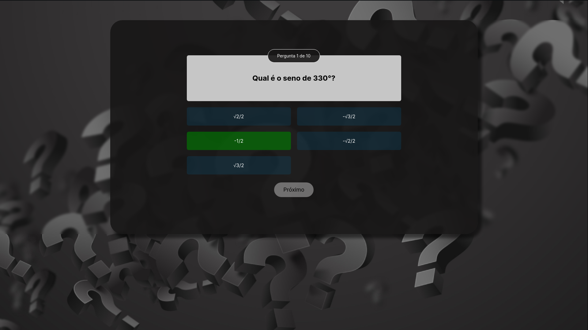
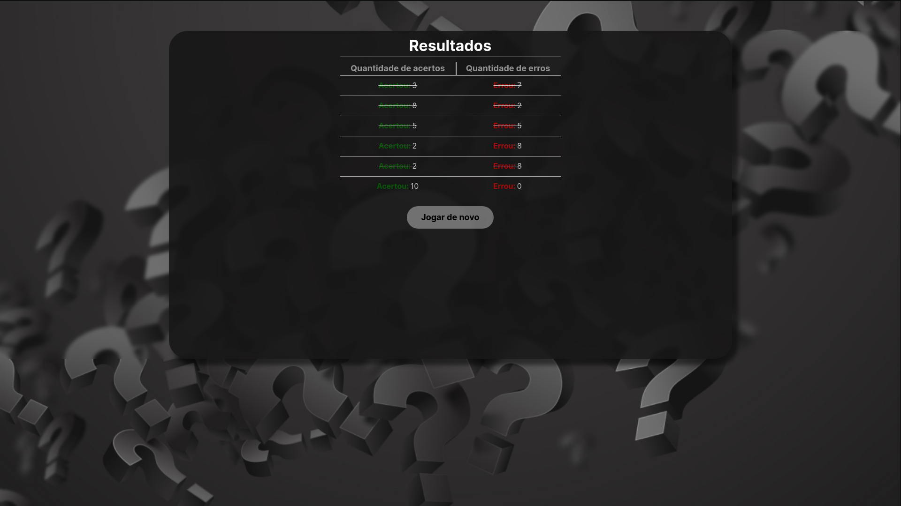

<h1 align="center">Quiz JavaScript</h1>

    Trabalho II - Programação Web

    <a href="#-tecnologias">Tecnologias</a>&nbsp;&nbsp;&nbsp;|&nbsp;&nbsp;&nbsp;
    <a href="#-projeto">Projeto</a>

 

## 🚀 Tecnologias

Esse projeto foi desenvolvido com as seguintes tecnologias:

- HTML5
- CSS3
- JAVASCRIPT

## 💻 Projeto

Esse projeto tem como objetivo construir um quiz com o tema livre aplicando os conhecimentos vistos em sala de aula de programação web do 1º semestre do curso Ciência da Computação, SenacSP 🧡.

 

<h2 align='center'>
  Tema: Matemática
</h2>

    

    

---

Feito com 💜 by Phelipe Pereira :wave:
